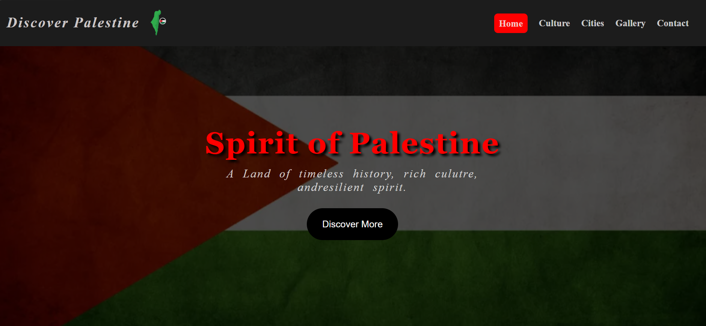
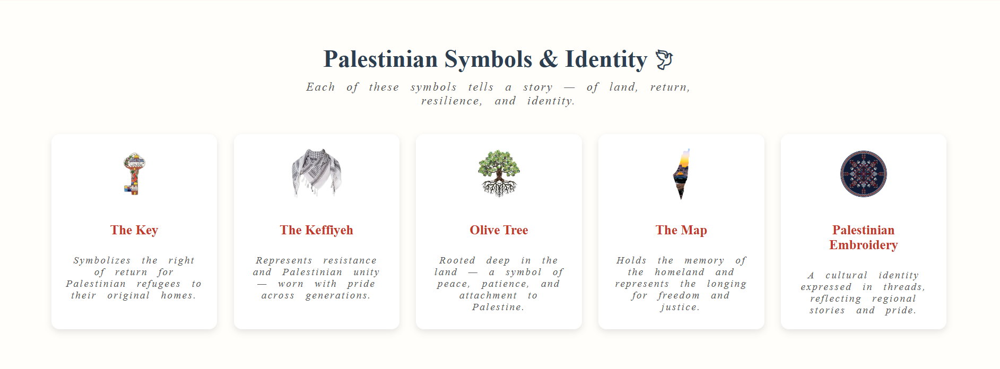

# discover-palestine
A modern and responsive website showcasing the beauty, culture, and history of Palestine 🇵🇸
# 🇵🇸 Discover Palestine

A modern and responsive website that showcases the beauty, culture, and rich history of Palestine.
This project highlights Palestinian cities, heritage, traditional food, clothing, and folklore in a clean and engaging design.

---

## ✨ Features

* 🏙️ Showcase of Palestinian cities
* 🕌 Historic places and landmarks
* 🍽️ Traditional Palestinian cuisine
* 👗 Cultural clothing and identity
* 🎶 Folklore and traditions
* 🕊️ National symbols and meanings
* 📱 Fully responsive design

---

## 🛠️ Built With

* HTML5
* CSS3
* (Optional: JavaScript if you add later)

---

## 📸 Preview




---

## 🚀 Live Demo

👉 https://username.github.io/discover-palestine/

---

## 📂 Project Structure

```
discover-palestine/
│── index.html
│── css/
│── images/
```

---

## 💡 Purpose

This project was created to present Palestine’s identity, culture, and history through a modern web experience.

---

## 👨‍💻 Author

**Mahmoud S Elkourd**

---

## 📜 License

This project is for educational and personal use only.

---

## ❤️ Support

If you like this project, consider giving it a ⭐ on GitHub!
